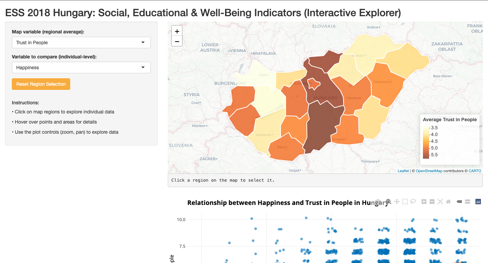
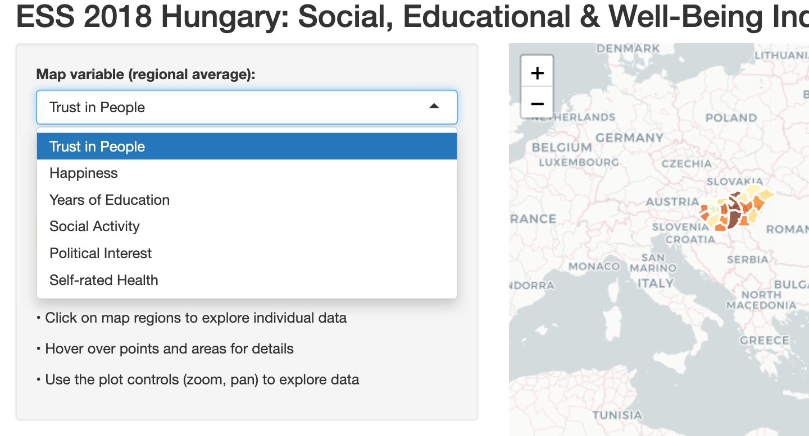
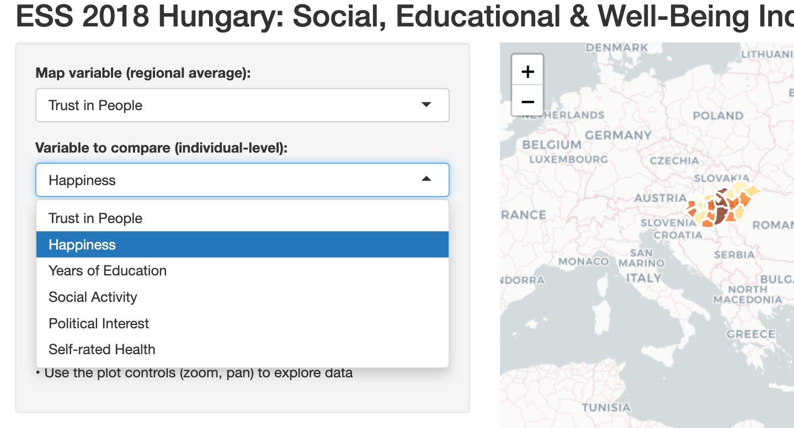
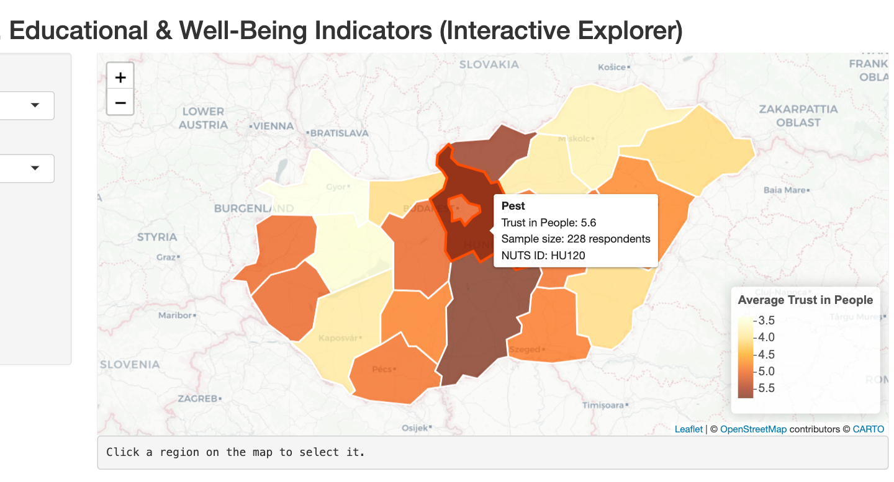
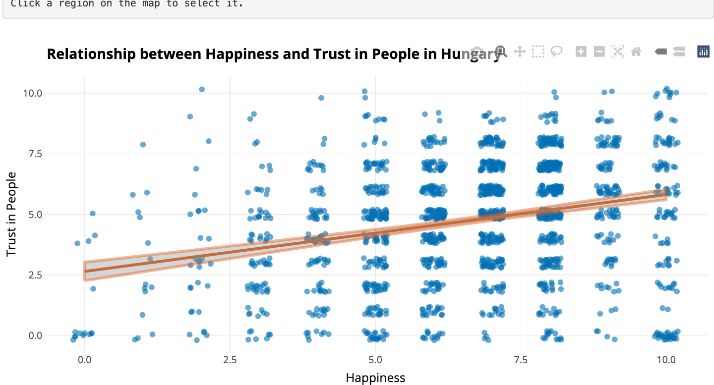
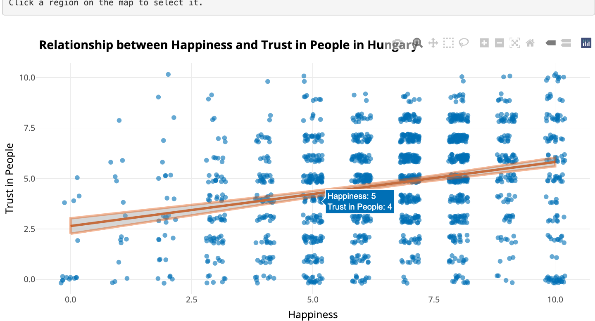
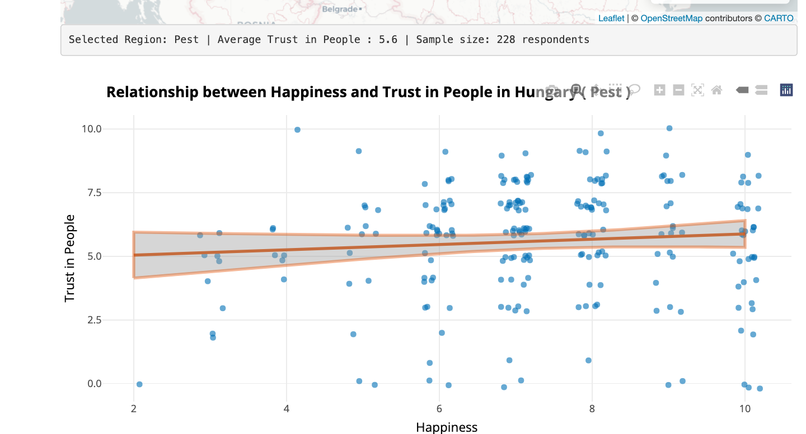
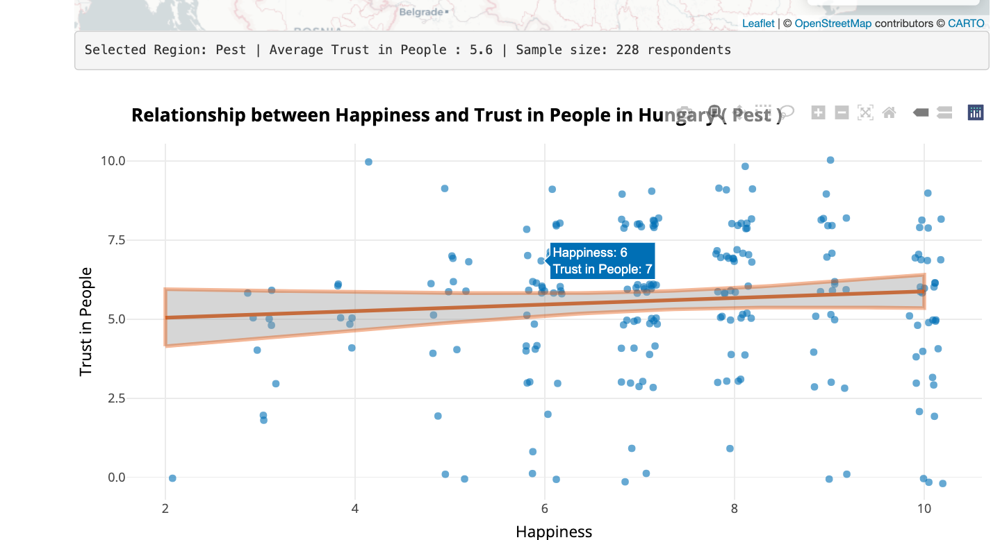
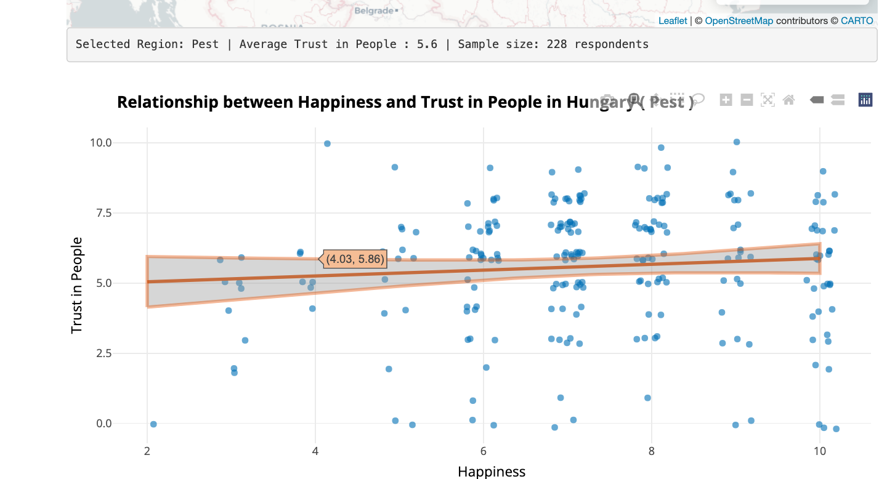
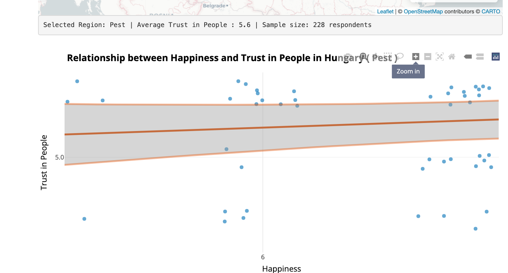

# Interactive Explorer for Hungarian Social Indicators (ESS 2018)

[](https://vectorvoyager.shinyapps.io/hungary_shiny_app/)

An interactive Shiny web application for exploring social, educational, and well-being indicators from the 2018 European Social Survey (Round 9) for Hungary.

**[➡️ View the Live Application Here](https://vectorvoyager.shinyapps.io/hungary_shiny_app/)**

---

### Overview

This application provides a user-friendly interface to visualize and analyze relationships within the Hungarian subset of the ESS 2018 dataset. It features an interactive map of Hungary's administrative regions (counties) and a corresponding scatter plot that allows users to explore correlations between different social variables, where each dot represents a single person's survey responses.



### Key Features

*   **Interactive Choropleth Map:** Visualize the regional averages of key indicators like Trust, Happiness, and Education across Hungary.
*   **Region-Specific Exploration:** Click on any region on the map to filter the scatter plot and explore the data for that specific area's respondents.
*   **Customizable Scatter Plot:** Select any two variables to compare against each other on the scatter plot, which shows individual respondent data.
*   **Interactive Data Points:** Hover over map regions and individual data points to see detailed information.
*   **Trend Analysis:** A linear regression line helps visualize the relationship between the selected variables.

---

### How to Use the Application: A Visual Guide

This guide walks you through the main features of the interactive explorer.

<table>
  <tr>
    <td colspan="2">
      <h5>1. Select Your Variables</h5>
      <p>Begin by using the dropdown menus. Choose a variable to display as a regional average on the map, and a second variable to compare on the scatter plot.</p>
    </td>
  </tr>
  <tr>
    <td width="50%"></td>
    <td width="50%"></td>
  </tr>
  <tr>
    <td width="50%" valign="top">
      <h5>2. Explore Regional Averages</h5>
      <p>Hover over any administrative region on the interactive map to see its name, the average value for the selected variable, and the number of survey respondents.</p>
    </td>
    <td width="50%">
      
    </td>
  </tr>
  <tr>
    <td width="50%" valign="top">
      <h5>3. Analyze the National Trend</h5>
      <p>Initially, the scatter plot shows the relationship between variables for all respondents across Hungary, giving you a view of the national picture.</p>
    </td>
    <td width="50%">
      
    </td>
  </tr>
  <tr>
    <td width="50%" valign="top">
      <h5>4. Inspect Individual Data (National View)</h5>
      <p>Even before filtering, you can hover over any data point on the national plot to see the specific values for an individual respondent from anywhere in the country.</p>
    </td>
    <td width="50%">
      
    </td>
  </tr>
   <tr>
    <td width="50%" valign="top">
      <h5>5. Filter for Local Insights</h5>
      <p>Click a region on the map to filter the scatter plot. The plot title and the text below the map update to confirm your selection, showing data only for that area.</p>
    </td>
    <td width="50%">
      
    </td>
  </tr>
  <tr>
    <td width="50%" valign="top">
      <h5>6. Inspect Individual Responses (Regional View)</h5>
      <p>After filtering, you can again hover over any data point to see the precise values for a single respondent, but this time only from within the selected region.</p>
    </td>
    <td width="50%">
      
    </td>
  </tr>
  <tr>
    <td width="50%" valign="top">
      <h5>7. See the Predicted Trend</h5>
      <p>Hover over the regression line itself to see the predicted value for the y-axis variable at any point along the x-axis, based on the linear model.</p>
    </td>
    <td width="50%">
      
    </td>
  </tr>
  <tr>
    <td width="50%" valign="top">
      <h5>8. Zoom in for a Closer Look</h5>
      <p>Use the built-in plot controls to zoom and pan, allowing for a more detailed inspection of the data points within your selected view.</p>
    </td>
    <td width="50%">
      
    </td>
  </tr>
</table>

---

### Technical Details

The application is built entirely in R using the following key packages:

*   **`shiny`**: For the web application framework.
*   **`sf`**: For handling spatial data (the Hungarian regions).
*   **`leaflet`**: For rendering the interactive map.
*   **`plotly`**: For creating the interactive scatter plot.
*   **`dplyr`**: For data manipulation and aggregation.
*   **`ggplot2`**: As the engine for the scatter plot, later converted by `plotly`.
*   **`haven`**: Used initially to process data from statistical software formats.

### How to Run This Project Locally

To run this application on your own machine, follow these steps:

1.  **Clone the repository:**
    ```bash
    git clone https://github.com/VectorTeller/Hungary-Social-Indicators-Explorer.git
    cd Hungary-Social-Indicators-Explorer
    ```

2.  **Install the required R packages:**
    Open R or RStudio and run the following command in the console:
    ```r
    install.packages(c("shiny", "dplyr", "sf", "plotly", "leaflet", "RColorBrewer", "ggplot2", "haven"))
    ```

3.  **Run the application:**
    In the R console, ensure your working directory is the project folder, then run:
    ```r
    shiny::runApp()
    ```

### Data Source

The data used in this application is a subset from the **European Social Survey (ESS) Round 9**, conducted in 2018. The dataset was preprocessed to select relevant variables for Hungary.

The regional boundaries are based on the official NUTS 3 (Nomenclature of Territorial Units for Statistics) classification, which corresponds to the counties of Hungary. For more information on the ESS, please visit their official website: [europeansocialsurvey.org](https://www.europeansocialsurvey.org/)

### Project Structure

```
├── .gitignore
├── LICENSE
├── README.md
├── preprocess_data.R
├── shiny_app.R
├── data/
│   ├── df_sel.Rds
│   └── nuts3.Rds
└── images/
    ├── 01-app-overview.png
    ├── 02a-select-map-variable.png
    ├── 02b-select-scatter-variable.png
    ├── 03-map-hover.png
    ├── 04-scatter-national-hover.png
    ├── 04-scatter-national.png
    ├── 05-scatter-regional.png
    ├── 06-scatter-regional-hover-point.png
    ├── 07-scatter-regional-hover-trend.png
    └── 08-scatter-regional-zoom.png
```

